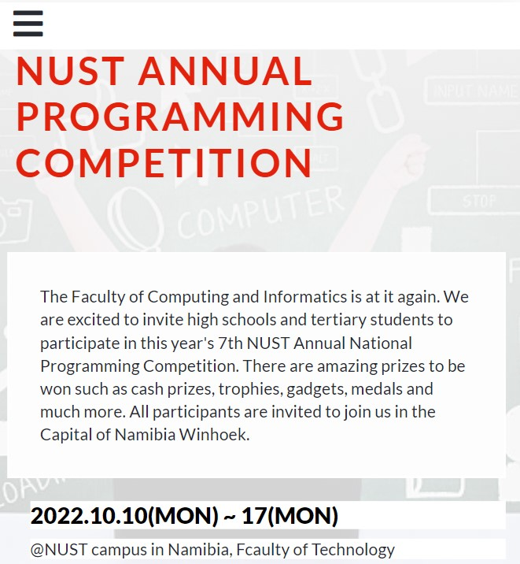

Capstone-Project:Programming Competition-page
This project is about a Programming competition which was held in Windhoek, Namibai at the Namibian Univeristy of Science and Technology.
The Faculty of Computing and Informatics invited high schools and tertiary students to participate in the 7th NUST Annual National Programming Competition. There were amazing prizes to be won such as cash prizes, trophies, gadgets, medals and much more.
This is made as Final Project (Capstone), of 1st Module at Microverse in order to attract job opportunities. The main objective is to develop a professional website which showcase my professional skills and also will meet the requirements of a client and be able to meet deadlines.

## In the first milestone the Capstone website, you will:
-Choose the topic for your website.(NUST Programming Competition)
-Choose images, text, icons, fonts (we suggest using Lato as it is a free font similar to the one used in the original design).
-Create the 2 pages for mobile.
-Deploy the project

# Project Screenshot image

## Link to the live page

## Getting Started

- Create a local directory that you want to clone the repository.

- Open the command prompt in the created directory.

- On the terminal run this command git clone https://github.com/Lucash2022/Capstone-Project-Competition-page.git

- Go to the repository folder using command prompt cd LucasErkanaPortfolio_Website.

- Install the dev dependencies for linters run npm install.

## Built with

- HTML, CSS & JAVASCRIPT 

## Authors

👤 **Lucas Erkana**

- GitHub: [@githubhandle](https://github.com/Lucash2022)
- Twitter: [@twitterhandle](https://twitter.com/@Lucas_David_22)
- LinkedIn: [LinkedIn](https://www.linkedin.com/in/lucas-erkana-b30a0b3b/)

## Collaborators

## 🤝 Contributing

## Show your support

Give a ⭐️ if you like this project!

## Acknowledgments

## 📝 License

This project is [MIT](./LICENSE) licensed.
